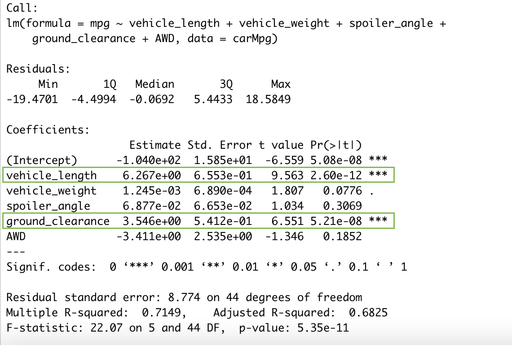

# MechaCar_Statistical_Analysis
## Summary
AutosRUs has an new model in production, the MechaCar, and is experiencing some issues in manufacturing stage. This analysis is to review the production data and look for insights for the manufacturing team.  
This analysis will address the following:
- Perform multiple linear regression analysis to identify which variables in the dataset predict the mpg of MechaCar prototypes.
- Collect summary statistics on the pounds per square inch (PSI) of the suspension coils from the manufacturing lots.
- Run t-tests to determine if the manufacturing lots are statistically different from the mean population.
- Design a statistical study to compare vehicle performance of the MechaCar vehicles against vehicles from other manufacturers. For each statistical analysis, you’ll write a summary interpretation of the findings.

## Part 1: Linear Regression to Predict MPG

**- Which variables/coefficients provided a non-random amount of variance to the mpg values in the dataset?**  
There are two variables from the data set which provide a non-random amount of variance to the MPG values: vehicle length and ground clearance. The other variables: vehicle weight, spoiler andles, and AWD do not appear to have an effect on the MPG for the MechaCar. 

**- Is the slope of the linear model considered to be zero? Why or why not?**  
If the p-value, or otherwise known as the significance level is found to be below 0.05, then we can conclude the slope of the linear model to have a slope that is not zero. The p-value for this data set is 5.35e-11, which indicates there is sufficient evidence to reject our null hypothesis and the slope of this linear model is not zero.

**- Does this linear model predict mpg of MechaCar prototypes effectively? Why or why not?**  
When determining if the linear model is effective, we can look at the Adjusted R-squared value. The closer the Adjusted R-squared value is to 1, the better the linear model is at prectiting effectiveness. In this analysis, our Adjusted R-squared is 0.6825. This means our linear model is effective at correctly predicting the MPG of MechaCar 68.25% of the time. Statistically speaking, we can say this model is effective at predicting the MPG of the MechaCar. Further testing could be done by elliminating the variables that do not appear to effect the MPG of the vehicle and look at the predictability of the new linear model with only vehicle length and ground clearance taken into account. 

## Part 2: Summary Statistics on Suspension Coils
The design specifications for the MechaCar suspension coils dictate that the variance of the suspension coils must **not exceed 100 pounds per square inch**. Does the current manufacturing data meet this design specification for all manufacturing lots in total and each lot individually? Why or why not?

**All manufacturing lots in total:**  
The variance for the suspension coils accross all lots is 62.29356 pounds per square inch. This variance is well below the 100 pounds per square inch requirement and therefore meet the design specifications. 

**Looking into each manufacturing lot individually:**  
Lots 1 and 2 each have a variance of 0.9795918 and 7.4693878, respectively. Therefore, both lots 1 and 2 are far below the max varience level of 100 pounds per square inch. Lot 3 however, has a varience level of 170.2861224, which exceeds the design specfications needed. 

## Part 3: T-Tests on Suspension Coils
First, we conducted a t-test on the suspetion coils dataset on all three lots together to see if there is a statistical difference between the mean of the dataset and the presumed population mean of 1500. Below are the results of the t-test:

From the t-test, we can see the mean of the sample from all three lots together is 1,497.507 and the p-value is 0.06028. Because the p-value is about 0.05, we can fail to reject the null hypothesis and conclude the mean of the three manufacturing lots together is statistically similar to the presumed population mean of 1500.

Next, we will perform the same t-testing on each individual manufacturing lot against the population mean of 1500. Below are the results from all three tests sumarries:

- Lot 1 has a sample mean of 1,500 and a p-value of 1. This concludes that Lot 1 is 100% identical to the population mean of 1,500. We can fail to reject the null hypothesis and conclude that ***Lot 1 is statistically similar to the population mean.***

- Lot 2 has a sample mean of 1,500.2 and a p-value of 0.6072. This concludes that Lot 2 is 60.72% similar to the population mean. We can fail to reject the null hypothesis and conclude that ***Lot 2 is statistically similar to the population mean.*** 

- Lot 3 has a sample mean of 1,496.14 and a p-value of 0.04168. This concludes that Lot 3 is about 4.1% similar to the population mean. We can reject the null hypothesis and conclude that ***Lot 3 is not statisitcally simiar to the population mean.***

## Part 4: Study Design: MechaCar vs Competition
Write a short description of a statistical study that can quantify how the MechaCar performs against the competition. In your study design, think critically about what metrics would be of interest to a consumer: for a few examples, cost, city or highway fuel efficiency, horse power, maintenance cost, or safety rating.

- What metric or metrics are you going to test?
cost, city/highway MPG, horsepower, annual maintainance cost, safety rating, resale value after 5 years, average lifespan of vehicle, and carbon footprint.

- What is the null hypothesis or alternative hypothesis?
null hypothesis (Ho): MechaCar is the best priced vehicle in its class based on its metrics.
alternative hypothesis (Ha): MechaCar is NOT the best priced vehicle in its class based on its metrics.

- What statistical test would you use to test the hypothesis? And why?
The best statistical test would be to use a mulitple linear regression model to determine the metrics with the highest correlation for MechaCar and its three highest competetors. From this test we can determine which metrics support this claim for the MechaCar being the best price to its competion. The cost of the vehicle would be the independent variable to test against all other metrics as the dependent variable. If there is a high correlation across across metrics, we can determine it is therefore a better priced vehicle when compared to competitors.

- What data is needed to run the statistical test?
Data needs to be collected from the top 3 major competetors for the past 5 years for all metrics: cost, city/highway MPG,  horsepower, annual maintainance cost, safety rating, resale value after 5 years, average lifespan of vehicle, and carbon footprint.
